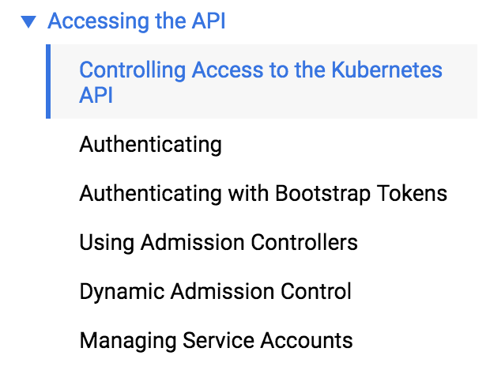
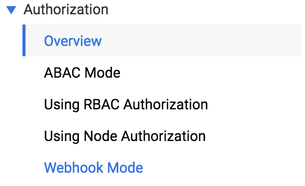
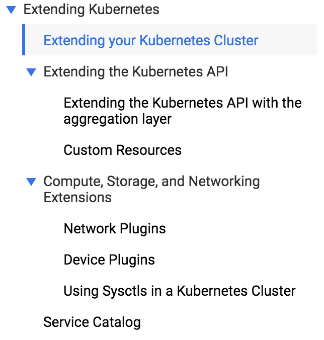
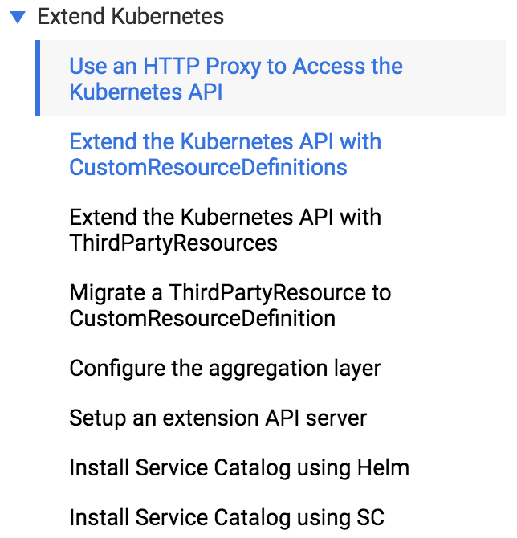

# Kubernetes

## Overview
- [Kubernetes Doc](https://kubernetes.io/docs)
- [Kubernete community overview](https://goo.gl/qqJ9mq)
    - [SIG List](https://github.com/kubernetes/community/blob/master/sig-list.md)
- [Kubernetes Learning Materials](https://docs.google.com/spreadsheets/d/10NltoF_6y3mBwUzQ4bcQLQfCE1BWSgUDcJXy-Qp2JEU/edit#gid=0)

## Auth
- [Kubernetes Doc - Accessing the API](https://kubernetes.io/docs/admin/accessing-the-api/)
  {:height="200px"}
- [Kubernetes Doc - Authorization](https://kubernetes.io/docs/admin/authorization/)
  {:height="200px"}
- [How Kubernetes certificate authorities work - Julia Evans](https://jvns.ca/blog/2017/08/05/how-kubernetes-certificates-work/)

## Extensions
- [Kubernetes Doc - Extending Kubernetes](https://kubernetes.io/docs/concepts/overview/extending/)
  {:height="200px"}
- [Kubernetes Doc - Extended Kubernetes](https://kubernetes.io/docs/tasks/access-kubernetes-api/http-proxy-access-api/)
  {:height="200px"}
- [GitHub - rook/operator-kit](https://github.com/rook/operator-kit)
- [GitHub - kstmp/metacontroller](https://github.com/kstmp/metacontroller)
- [GitHub - kubernetes/sample-controller](https://github.com/kubernetes/sample-controller)
- [GitHub - kubernetes/sample-apiserver](https://github.com/kubernetes/sample-apiserver)
- TGIK
- [Brendan Burns at Twitter](https://twitter.com/brendandburns/status/969686987786637313)
